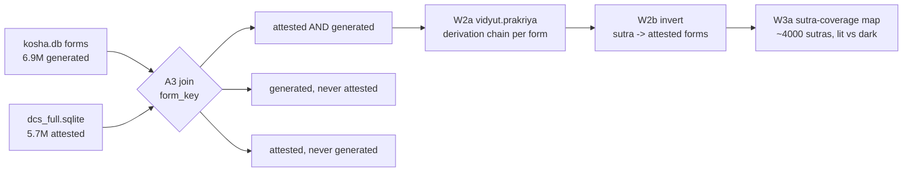

# Architecture — kosha Concordance Q3 (Pāṇinian sūtra ↔ corpus)

_Created: 18-07-2026 · Last updated: 18-07-2026_

Design for the A4 Pāṇinian concordance and the A3 join it stands on. Rulings are
in [PLAN_KOSHA_CONCORDANCE_Q3_2026H2.md](https://github.com/gasyoun/kosha/blob/main/docs/PLAN_KOSHA_CONCORDANCE_Q3_2026H2.md);
wave order in [ROADMAP_KOSHA_2026H2.md](https://github.com/gasyoun/kosha/blob/main/docs/ROADMAP_KOSHA_2026H2.md).

---

## 1. Shape of the thing

A4 inverts a derivation engine into a concordance. Three stages, each a
committed artefact:

Only the **attested ∧ generated** bucket feeds the derivation harness — a form
that is not attested has no corpus locus to cite, and a form the engine cannot
generate has no derivation to capture. The other two buckets are A3's own
research output and are reported, not discarded.

**Reuse, don't rebuild.** Per the repo's maximum-reuse rule, this design adds
exactly one new capability — capturing and inverting the sūtra chain. Everything
else already exists: `form_key()` for the join,
[`scripts/concordance_core.py`](https://github.com/gasyoun/kosha/blob/main/scripts/concordance_core.py)
for the record schema,
[`app/cite.py`](https://github.com/gasyoun/kosha/blob/main/app/cite.py) for
citation minting, the Q1 concordance viewer's **shell and shard-loading pattern**
for the web layer (a fork, not a drop-in — §9 measures what that costs), and
[`scripts/compare_vidyut_cologne.py`](https://github.com/gasyoun/kosha/blob/main/scripts/compare_vidyut_cologne.py)
as the working precedent for driving `vidyut.prakriya` as a local library.

---

## 2. Record schema

A4 instantiates the canonical concordance record — `RECORD_FIELDS` in
[scripts/concordance_core.py](https://github.com/gasyoun/kosha/blob/main/scripts/concordance_core.py),
which is the executable definition, not the prose in
[CONCORDANCE_ROADMAP.md](https://github.com/gasyoun/kosha/blob/main/CONCORDANCE_ROADMAP.md)
— with `anchor_type = panini-sutra`. The ID grammar for both sides is
[Uprava/TYPED_LINK_ID_GRAMMAR.md](https://github.com/gasyoun/Uprava/blob/main/TYPED_LINK_ID_GRAMMAR.md)
§2 (anchors) and §3 (target loci); the pre-H539 names `corpus_locus`/`corpus_text_id`
were renamed to `target_locus`/`source_dataset` there and **must not** be reintroduced.
Fields marked **new** are the A4 extension and are additive, following the precedent
of [`build_dict_corpus_concordance.py`](https://github.com/gasyoun/kosha/blob/main/scripts/build_dict_corpus_concordance.py),
which writes `RECORD_FIELDS` plus four dataset-specific columns.

| Field | Meaning for A4 |
|---|---|
| `anchor_type` | constant `panini-sutra` |
| `anchor_id` | prefixed sūtra ID per TYPED_LINK_ID_GRAMMAR §2 — `sutra:<a.p.n>`, e.g. `sutra:6.1.77` |
| `anchor_key_slp1` | **empty.** TYPED_LINK_ID_GRAMMAR §1 fills this only for root/lemma anchors and leaves it empty for a `§`/sūtra anchor. The attested form's key travels in `form_key_slp1` below |
| `target_locus` | `dcs:<sent_id>` from `concordance_core.citable_locus()` — host-independent per TYPED_LINK_ID_GRAMMAR §3 (R1/R5: never a URL) |
| `source_dataset` | which committed dataset asserts the link — TYPED_LINK_ID_GRAMMAR §1's "path or manifest id", i.e. the `paninian-corpus-concordance` manifest id. **Not** the DCS text name |
| `match_method` | `floor` for a `form_key()` join, `exact` only where the SLP1 keys are additionally byte-identical. Never `relaxed`/`fuzzy` (D6) |
| `confidence` | **looked up from `concordance_core.TIER_CONFIDENCE`, never hand-set** — `exact` ⇒ **0.95**, `floor` ⇒ **0.85** |
| `evidence_count` | attestation count for this form |
| `form_key_slp1` **new** | the attested form's length-preserving `form_key()` — the actual A4 join key, carried explicitly because `anchor_key_slp1` is empty for sūtra anchors |
| `dcs_text` **new** | which of the 270 DCS texts the locus falls in (the text component of `human_locus()`) — a reporting column, not a join key |
| `chain_position` **new** | 1-based index of this sūtra in the ordered derivation |
| `chain_length` **new** | total sūtras in the derivation |
| `chain_id` **new** | stable hash of the full ordered chain — lets a reader recover the whole derivation from any one row |
| `derivation_status` **new** | `ok` · `no-derivation` · `ambiguous` · `engine-error` |
| `tense_caveat` **new** | `1` when the attestation's morphology depends on DCS `Tense=Past` (R-C4), else `0` |

**Why `match_method` is `floor`, not a constant `exact`.** `concordance_core`'s
`TIER_CONFIDENCE` defines the tiers precisely: `exact` = **byte-identical SLP1**
(0.95); `floor` = length-preserving `form_key()` — anusvāra/homorganic-nasal fold
plus final-visarga strip, with `ā ≠ a` preserved (0.85). Every A4 join in this plan
set is specified on **`form_key()` equality**, which is the *floor* tier, not
`exact`. Labelling those rows `exact`/1.0 would claim a confidence they did not
earn — a silent over-assertion of exactly the kind D6 exists to prevent. `exact` is
a proper subset of `floor` (byte-identical SLP1 implies equal `form_key`), so a
builder may record `exact` on the rows that qualify and `floor` on the rest; what it
may not do is emit one constant. **`confidence` is always a `TIER_CONFIDENCE`
lookup, never a literal in the builder.**

**"Strict tier" means the asserted set, not `exact` alone.** D6's ruling is
implemented in `build_dict_corpus_concordance.py` as
`ASSERTED = ("xref", "exact", "floor")` — and it is *that* set which scored **11/11**
on the golden sample ([GOLDEN_SAMPLE.md](https://github.com/gasyoun/kosha/blob/main/data/concordance/GOLDEN_SAMPLE.md):
4 xref, 4 exact, 3 floor). Only `relaxed`/`fuzzy` were quarantined. Reading D6 as
"`exact` only" would discard the floor tier that the golden sample explicitly
validated.

**Why `chain_id` rather than repeating the chain per row.** A form with a
12-sūtra derivation would otherwise duplicate the chain 12 times. `chain_id`
points into a sidecar `derivation_chains.tsv` (`chain_id` → ordered sūtra list),
keeping the concordance narrow and the chain recoverable. This matters at scale:
the row count is `attested_forms × mean_chain_length`, not `attested_forms`.

**Why `derivation_status` is a column and not a filter.** R-C3 requires the dark
set be reported. Rows with `no-derivation` carry no `anchor_id` and are written to
a **separate** artefact rather than polluting the sūtra-keyed table — but they are
counted, classified, and published alongside it. A coverage map that silently
omits its failures is the failure mode this column exists to prevent.

---

## 3. The A3 join (W1b)

Three buckets on `form_key()` equality:

| Bucket | Definition | Research meaning | Feeds A4 |
|---|---|---|---|
| **AG** | in `kosha.db forms` ∧ in DCS attested | confirmed | **yes** |
| **G¬A** | generated, never attested | over-generation by the engine, or genuine corpus gap | no |
| **A¬G** | attested, never generated | engine/grammar gap, or OCR/segmentation error | no — but **triaged** and routed to the csl-inflect give-back |

**Join key discipline.** `form_key()` is length-preserving. The
NFD-plus-strip-combining-marks approach is banned repo-wide because it destroys
vowel length and retroflexion — the exact defect that made the relaxed
concordance tier score 0/3 and get dropped (D6). A4 inherits that ruling: the
join is strict, and a near-match is not a match.

**Trust ordering in `forms`.** `dcs > vidyut > heritage`, and heritage rows are
**default-off** since H696. The A3 join must not silently pull in heritage forms
— they are hypergenerated and untrusted, and including them would inflate the AG
bucket with forms no one attests. Pass `include_heritage=False`.

**R-C4 propagation.** DCS conflates aorist and perfect under `Tense=Past`. A verb
form whose bucket assignment or sūtra attribution depends on that distinction gets
`tense_caveat=1` and is reported as a separate line in every count. It is not
excluded — excluding it would understate coverage — but no aggregate is published
without the caveated subtotal beside it.

---

## 4. Derivation capture (W2a)

`vidyut` 0.4.0 is importable in this environment and already driven as a local
library by `compare_vidyut_cologne.py` — **no live third-party call at build or
query time** (RISKS R12). A4 keeps that property.

Per AG-bucket form:

1. Map the kosha lemma + morphology to a `vidyut.prakriya` derivation request
   (the nominal mapping — `Pratipadika.basic`, `Linga`, `Vibhakti`, `Vacana` —
   is already proven in E1; the verbal mapping over dhātu + gaṇa + lakāra is the
   new work and is where most `engine-error` will come from).
2. Run the derivation; capture the **ordered sūtra sequence**.
3. Compare the engine's output form against the attested form. **Only an exact
   `form_key()` match counts as a derivation of that form.** A derivation that
   lands on a different form is `ambiguous`, not `ok`.
4. Emit one concordance row per `(sūtra, form, locus)` triple, plus one sidecar
   chain row.

**Ambiguity is expected and is data.** Several sūtras can produce the same
surface form, and vidyut may return multiple derivations. A4 does not pick a
winner — it records all of them with `derivation_status=ambiguous` and lets the
coverage map report ambiguity rate per sūtra. Picking a winner would be inventing
a philological ruling the engine did not make.

---

## 5. The sūtra-coverage map (W3a) — the exit check

The programme's stated exit check. Its design decides whether the deliverable is
honest.

For each sūtra in the Aṣṭādhyāyī:

| Column | Meaning |
|---|---|
| `sutra_id` | `A.P.S` |
| `exemplar_forms` | distinct attested forms whose derivation includes it |
| `exemplar_loci` | distinct corpus loci |
| `texts` | distinct DCS texts |
| `mean_chain_position` | where in a derivation it typically fires |
| `status` | `lit` · `dark-unattested` · `dark-out-of-scope` · `dark-engine-gap` |

**The three dark classes are the point.** Reporting "N sūtras have no exemplars"
is nearly useless, because the reasons are entirely different in kind:

- **`dark-unattested`** — vidyut implements the sūtra, it fires in derivations,
  but no derivation containing it lands on an attested form. A genuine
  philological finding: the rule is real and the corpus does not exercise it.
- **`dark-out-of-scope`** — vidyut does not implement the sūtra at all
  (metarules, adhikāra headers, saṃjñā definitions, and the accent/Vedic rules a
  practical engine skips). An **engine-coverage** fact, and says nothing about
  the corpus.
- **`dark-engine-gap`** — vidyut implements it, but every derivation touching it
  errored. A **defect** signal, and the class that should be smallest.

Collapsing these three into one "dark" number would be the single easiest way to
make this deliverable look better than it is, and is therefore forbidden. The
published map reports all four statuses with counts, and the release notes state
the ratio between them.

**Denominator honesty.** "~4,000 sūtras" is itself approximate — recensions
differ on sūtra division. The map states which enumeration it uses and its exact
count, and every percentage is reported against that stated denominator.

---

## 6. Pages budget and the static-head rule (D4)

### The standing rule

> **Standing rule (D4).** Any static Pages tier in kosha ships a **head chosen by
> measured corpus token coverage (~95%)** with the tail served by SSR at
> `/w/{slp1}`. The head size **N is measured from the current frequency data at
> build time**, never carried forward as a constant and never rounded to a
> pleasing number. The build logs N, the coverage it achieves, the byte total,
> and the resulting share of the Pages cap.

This is the third time the question has been asked (D5-3 for cards, the H537
word-page build, now A4). It is recorded as standing so it is not asked a fourth.

### The measurement (18-07-2026)

From [data/frequency/lemma_frequency.tsv](https://github.com/gasyoun/kosha/blob/main/data/frequency/lemma_frequency.tsv):
**59,282** lemmas carry `count_all`, totalling **4,550,704** tokens.

| Target coverage | N (lemmas) | Actual |
|---:|---:|---:|
| 50% | 339 | 50.03% |
| 80% | 2,482 | 80.00% |
| 90% | 5,845 | 90.00% |
| 92.5% | 7,773 | 92.50% |
| **95%** | **11,148** | **95.00%** |
| 97% | 16,646 | 97.00% |
| 99% | 32,367 | 99.00% |
| 100% | 59,282 | 100.00% |

**N = 11,148.** The curve is steeply Zipfian — 339 lemmas carry half the corpus,
and the last 5% of coverage costs 48,134 additional lemmas. That asymmetry is the
whole argument for a head/tail split.

### Cross-check of the inherited figures

| Figure | Source | This measurement | Verdict |
|---|---|---|---|
| Word pages ≈ 9.7 KB/page | H537 build log | used as given | accepted |
| Full word-page set ≈ 478 MB | [.ai_state.md](https://github.com/gasyoun/kosha/blob/main/.ai_state.md) | 9.7 KB × 50,355 = **477.0 MB** | **confirmed** |
| Card set = 402 MB | measured 03-07-2026 | used as given | accepted |
| "Exceeds the ~1 GB Pages soft cap" | [.ai_state.md](https://github.com/gasyoun/kosha/blob/main/.ai_state.md) | 402 + 477 = **879 MB = 86% of 1,024 MB** | **incorrect — it does not exceed** |
| "top-10k = 95.4% coverage" | [KOSHA_DECISIONS_NEEDED.md](https://github.com/gasyoun/kosha/blob/main/KOSHA_DECISIONS_NEEDED.md) D5-3 | top-10k = **94.32%**; 95.4% is reached at N ≈ 12,000 | **different denominator** — D5-3 counts the 50,355 entry-bearing attested lemmas; this table counts the 59,282 lemmas with `count_all`. Neither is wrong; the denominator must always be stated |

**What the corrected budget changes.** The ruling stands, but the *reason* changes
from "we would overflow" to "we would ship at 86% of cap with no room for the next
ingest". Given that `kosha.db` grew 5.8× in ten days (R-Q1), the 14% that would
remain is not a margin. Recording the true number matters: a future session told "we
overflowed" would draw the wrong conclusion when it measures 879 MB and finds it fits.

**879 MB / 86% is a projection, not the deployed state.** What is actually on Pages
today is the **card tier only — 402 MB, 39% of the 1,024 MB cap, ~60% headroom**,
which is what
[.ai_state.md](https://github.com/gasyoun/kosha/blob/main/.ai_state.md) records and
which is **correct as written**. The full 50,355-page word set has never shipped
(README's phase table still gates P5's public URL on the P2 deploy). 86%/14% is the
*hypothetical* figure if that full set were added un-headed — which is precisely the
scenario D4 exists to prevent. Both numbers are right about different tiers; neither
should overwrite the other.

### Resulting budget

| Tier | N | Size | Share of 1,024 MB |
|---|---:|---:|---:|
| Cards (deployed, unchanged) | 50,355 | 402 MB | 39% |
| Word pages, **static head** | **11,148** | **105.6 MB** | 10% |
| **Subtotal** | | **507.6 MB** | **50%** |
| Word-page tail (SSR, not on Pages) | 39,207 | 0 MB | 0% |
| A4 concordance pages | measured in W4b | budgeted ≤ 100 MB | ≤ 10% |

Roughly 40% of the cap stays free. W4b re-measures with A4 pages included rather
than trusting this projection.

---

## 7. Licence composition

| Input | Licence | Role |
|---|---|---|
| DCS corpus attestations | **CC BY 4.0** — resolved W1a/H1263 (DCS `conllu/readme.md`); `external_tools.json` corrected from BY-SA | loci, evidence counts |
| CDSL dictionary data | CC BY-SA 4.0 | lemma anchors |
| Aṣṭādhyāyī sūtra text | public domain (ancient) | sūtra identifiers |
| vidyut code | **MIT** (per [external_tools.json](https://github.com/gasyoun/kosha/blob/main/data/manifest/external_tools.json)) | derivation engine |
| vidyut **bundled data** (dhātupāṭha, rule tables) | **MIT** — resolved W1a/H1263 (`vidyut-prakriya/data/README.md`, via ashtadhyayi.com); source texts public domain | derivation metadata |

> **Resolved 18-07-2026 (W1a / [H1263](https://github.com/gasyoun/Uprava/blob/main/handoffs/H1263-Opus_kosha_vidyut_derivation_metadata_rights_record_18.07.26.md)).** Both the DCS contradiction and the vidyut-data unknown below are settled in [data/manifest/rights/vidyut_prakriya_derivation_2026-07.md](https://github.com/gasyoun/kosha/blob/main/data/manifest/rights/vidyut_prakriya_derivation_2026-07.md): DCS = CC BY 4.0, vidyut code + data = MIT. No `@DECIDE` triggered. The two subsections that follow record the open-question framing as it stood before W1a ran.

**Expected ruling:** output is **CC BY-SA 4.0**, vidyut attributed. MIT is
permissive and composes into a ShareAlike work without conflict; BY-SA is
inherited from DCS and CDSL and is not optional. Note the repo's two-tier rule —
code is CC BY-NC 4.0, data is CC BY-SA 4.0, and the non-commercial restriction
**may not** be added on top of Cologne's ShareAlike.

**Open question — the repo contradicts itself on DCS's licence.**
[external_tools.json](https://github.com/gasyoun/kosha/blob/main/data/manifest/external_tools.json)
(`id: dcs`) records **CC BY-SA 4.0**, while
[CONCORDANCE_ROADMAP.md](https://github.com/gasyoun/kosha/blob/main/CONCORDANCE_ROADMAP.md)
line 151 — the parent doc of this programme — says *"B1/B3 join DCS (CC BY 4.0)"*,
and the `reading-pack-*` manifest notes repeat "DCS is CC BY 4.0". This plan does
**not** pick one. What it does *not* change is the output licence: **CDSL dictionary
data (CC BY-SA 4.0) is an A4 input under either answer**, so ShareAlike binds
regardless — as §7's own input table and the repo's two-tier rule already state. What
it changes is the attribution and provenance record, and the plain fact that one of
kosha's own files is wrong about a primary input. W1a resolves it against
DCS's own published terms (Hellwig's repository/site, not a kosha secondary source),
writes the finding into the rights record, and corrects whichever kosha file is
wrong in the same pass. Until then, A4 output is treated as **BY-SA** — the
conservative branch, which is safe under either answer.

**The one genuine unknown on the vidyut side** is the bundled-data licence. W1a reads vidyut's own
`LICENSE`, any per-directory licence files, and its data provenance notes, and
writes the record in the shape of the
[Franceschini permission record](https://github.com/gasyoun/kosha/blob/main/data/manifest/rights/franceschini_hos9_permission_2026-07-13.md).
If the bundled data turns out to carry different terms, W1a **stops and surfaces**
rather than choosing — that is a rights decision.

**Unrelated and still blocked:** the Heritage LGPLLR question keeps
`heritage-forms-crosswalk-extras` (which contains the DICO French glosses) at
`restricted`. A4 does not consume it, so A4 is not blocked by it.

---

## 8. Manifest schema hardening (D8)

Current state, verified: all 77 rows **have** `in_release`; 38 are `null`, 32 are
`"unreleased"`, 7 name `data-v0.1.0`. `release_asset` is present on 39 and absent
on 38. The defect is an **undefined vocabulary**, not an absent field.

| Change | Rule |
|---|---|
| `in_release` | required, closed vocabulary: `"<release-tag>"` · `"unreleased"` · `"not-applicable"` |
| `"not-applicable"` | for rows kosha does not host — external/restricted assets. Replaces the current ambiguous `null` |
| `release_asset` | required whenever `tier == "public"` **and** `in_release` names a release tag |
| Validation | a schema check in [tests/test_directory.py](https://github.com/gasyoun/kosha/blob/main/tests/test_directory.py), failing CI on violation |

The migration is mechanical: each `null` becomes `not-applicable` or `unreleased`
depending on whether kosha hosts the asset. **Making the field required is the
whole point** — an optional field is how 32 rows drifted into an unreleased
backlog with nobody noticing.

---

## 9. Web surface (W4a)

Fork the Q1 concordance viewer, themed for sūtras — anchor list → click → KWIC
attestations in context, scan-anchored.

**What "reuse" actually means here — measured, not assumed.** The Q1 viewer is
[concordance/dict/index.html](https://github.com/gasyoun/kosha/blob/main/concordance/dict/index.html);
it does **not** read `dict_corpus_concordance.tsv` (that file appears in it only as
a hyperlink in the trust block). It loads per-first-letter shards
`concordance/dict/data/kwic_<a>.js`, each a `window.CONC_DATA[<letter>]` object
keyed by SLP1 anchor with `{iast, dicts, n, lemmas:[{id, lemma, tier, tok, texts,
kwic:[{form, cite, locus, sent}]}]}`. A grep over `concordance/` finds **zero**
occurrences of any `RECORD_FIELDS` name. So the record schema and the viewer's data
format are **already decoupled today**, and no schema choice in §2 makes the viewer
work by itself.

The reusable part is therefore the **HTML/JS shell and the shard-loading pattern**,
not a data contract. W4a's actual work:

1. A shard emitter in `build_panini_concordance.py` modelled on
   `build_dict_corpus_concordance.py`'s KWIC pass — sharded by sūtra **adhyāya**
   (1–8) rather than by first letter, since sūtra IDs are numeric.
2. A shard payload extended with the A4 affordances: the resolved derivation chain
   per form, and the `status` used by the coverage view.
3. A copy of the viewer at `concordance/panini/index.html` with the anchor-list
   labels, shard-key function, and trust block retargeted.

Two A4-specific affordances:

- **Chain view.** A form's full derivation, sūtra by sūtra, resolved from
  `chain_id`. This is the thing no other resource offers.
- **Coverage view.** The sūtra-coverage map as a browsable surface, with the dark
  classes **visibly distinguished** rather than filtered out — the honesty
  requirement from §5 applied to the UI.

Per the house `/viz-page` pattern: trust block (source artefact, n, date) and a
data-table fallback with CSV download. Per RISKS R1/R5, citation URLs carry
`PUBLIC_BASE`, never the deployment host — this is what makes migration M1 a
config change rather than a rewrite.

---

_Dr. Mārcis Gasūns_
