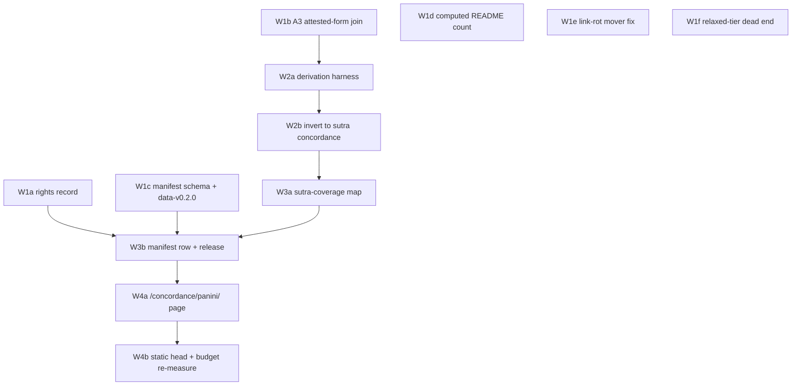

# Roadmap — kosha, 2026 H2

_Created: 18-07-2026 · Last updated: 18-07-2026_

The wave order for kosha's second half of 2026, under the rulings recorded in
[PLAN_KOSHA_CONCORDANCE_Q3_2026H2.md](https://github.com/gasyoun/kosha/blob/main/docs/PLAN_KOSHA_CONCORDANCE_Q3_2026H2.md).
Read that plan's §1 (naming) and §3 (corrected premises) first — this roadmap
assumes both.

---

## 1. Where the repo actually stands

Verified 18-07-2026 against the worktree, not inherited from a summary.

| Signal | State |
|---|---|
| Agent-runnable build queue | **Empty** — which is not the same as "everything is done". `IMPLEMENTATION_PLAN` P1/P3 are done; **P2 is "generator built (v0.5.0) — next: MG deploy"** and **P5 is "word page built … public URL + reading packs gated on P2 deploy / DCS corpus data"** (README phase table); **P6 and P7 are still specced** in `IMPLEMENTATION_PLAN` and gated on human review/rights and on P2+P3. Pedagogy W0–W3a shipped; W3b reuse-only; W4 content-gated. So: nothing an agent may start without a human first deploying or ruling — that is the claim, and it is the one that motivates this roadmap |
| Open issues / open PRs | **0 / 0** |
| Releases | **24 tags** in `v0.36.0`…`v0.59.0` **inclusive** (23 cut *after* `v0.36.0`), spanning **13-07** → **15-07-2026**, **70 commits** in that range |
| Commits | **237** — the repo's **entire** history, first commit **02-07-2026** → 18-07-2026. `v0.36.0..origin/main` is **74**. These are two different windows and were previously reported as one |
| Manifest | **77 rows** (63 public · 11 restricted · 3 intermediate); 32 rows `unreleased`; 7 rows in `data-v0.1.0` |
| Concordance programme | Q1 (B1, dict ↔ corpus) built · Q2 (B3, parallel passages + Bloomfield) built · **Q3/A3 not built** · Q4/A4 not started |
| Local inputs for A4 | **All present.** `vidyut` 0.4.0 importable · `kosha.db` 1.67 GB · `dcs_full.sqlite` 920 MB · `archive.sqlite` 168 MB |

**The agent-runnable queue being empty is the reason this roadmap exists**, and it
is also why wave 1 can be large: there is no in-flight work to contend with. Note
the precision — the *specced* queue is not empty (P6, P7, and the P2/P5 deploy
legs remain), but every item left in it is blocked on a human deploy, a rights
ruling, or corpus data. That is a defensible reason to open a new programme; "P1–P5
done" would not have been.

**One risk surfaced by that inventory, not previously recorded.** `kosha.db` is
now **1,673,854,976 B (1.67 GB)**, against the **289.8 MB** measured at D5 on
03-07-2026 — a **5.8× growth in ten days**, driven by the heritage/evidence/
inflection ingests. That is **84% of the 2 GB GitHub release-asset ceiling**,
where [D5_MEASUREMENTS.md](https://github.com/gasyoun/kosha/blob/main/D5_MEASUREMENTS.md)
§1 still reports "14.5% — ample headroom for growth". A4 adds derivation metadata
to the same database. This is tracked as **R-Q1** below and is a wave-1 measurement,
not a wave-4 surprise.

---

## 2. Wave order

Waves are ordered by **dependency**, then by **what unblocks a release**. Each
wave is a handoff; specs are in
[IMPLEMENTATION_KOSHA_CONCORDANCE_Q3.md](https://github.com/gasyoun/kosha/blob/main/docs/IMPLEMENTATION_KOSHA_CONCORDANCE_Q3.md).

### Wave 1 — unblock, then join (runnable now)

Wave 1 does two things at once: it clears the four hygiene defects that would
otherwise corrupt this quarter's own bookkeeping, and it builds the A3 join that
A4 cannot start without.

| ID | Deliverable | Blocks | Tier |
|---|---|---|---|
| **W1a** | Derivation-metadata **rights record** — verify vidyut code *and bundled data* licences, write `data/manifest/rights/vidyut_prakriya_derivation_2026-07.md` | Every A4 publication (D2) | Opus |
| **W1b** | **A3 join** — `morphology-attestation-audit`: generated × attested on `form_key()`, three buckets, aorist/perfect caveat carried | W2, W3 (D12) | Opus |
| **W1c** | Manifest **schema hardening** + catch-up `data-v0.2.0` clearing the 32-row backlog | D7 rolling cadence | Sonnet |
| **W1d** | **Computed README dataset count** + test invariant | Recurrence of D9 | Haiku |
| **W1e** | **Link-rot mover fix** + one-time catch-up + H900 registry row | Recurrence of D11 | Sonnet |
| **W1f** | **Relaxed-tier dead-end record** → `DEAD_ENDS`, sheet cancelled | D6 closed | Haiku |

W1a, W1c–W1f are independent of each other and of W1b; all six can run in
parallel. **W1b is the long pole** and should start first.

### Wave 2 — derivation chains

| ID | Deliverable | Depends on |
|---|---|---|
| **W2a** | Derivation harness: for each attested form from W1b, run `vidyut.prakriya`, capture the **ordered sūtra chain**, record derivation success/failure with a typed failure class | W1b |
| **W2b** | Invert to the concordance: `sūtra → {attested forms}` with corpus loci and evidence counts, in the canonical concordance record schema | W2a |

Wave 2 produces the dataset but publishes nothing — W1a gates publication.

### Wave 3 — coverage map and release

| ID | Deliverable | Depends on |
|---|---|---|
| **W3a** | **Sūtra-coverage map** — per-sūtra exemplar counts across the Aṣṭādhyāyī, with the dark set named, counted, and *classified* (genuinely unattested vs. out of vidyut's rule coverage vs. corpus-gap) | W2b |
| **W3b** | `paninian-corpus-concordance` manifest row + public data release (rolling cadence, D7) | W3a, W1a, W1c |

### Wave 4 — surface

| ID | Deliverable | Depends on |
|---|---|---|
| **W4a** | `/concordance/panini/` web page on the interim host, house `/viz-page` pattern (trust block: source artefact, n, date; CSV fallback) | W3b |
| **W4b** | Apply the **D4 standing rule** — static head at N = 11,148, SSR tail via `/w/{slp1}` — and **re-measure** the Pages budget with A4 pages included | W4a |

### Migration — not a wave

**M1** (repoint to samskrtam.ru, re-run exit checks) fires on MG's word that the
deploy is live, ~25-07-2026. It is independent of wave order and can land between
any two waves. See [plan §4](https://github.com/gasyoun/kosha/blob/main/docs/PLAN_KOSHA_CONCORDANCE_Q3_2026H2.md).

---

## 3. Dependency graph

The three unattached wave-1 nodes (W1d, W1e, W1f) are hygiene: they gate nothing
downstream, which is exactly why they have been deferred repeatedly and why they
are pinned into wave 1 rather than left floating.

---

## 4. Explicitly out of scope this quarter

Naming these prevents a later session from "helpfully" reopening them.

| Item | Why out | Where it went |
|---|---|---|
| Relaxed concordance tier review (2,171 items) | Ruled dropped (D6); golden sample 0/3 correct | `DEAD_ENDS` record, W1f |
| Flipping the DICO French-gloss layer to public | Heritage LGPLLR unresolved — a human rights decision | Rights brief prepared, `@DECIDE` surfaced |
| Confirming `Polnorazmernye/` as canonical parallel-passage variant | Open `@DECIDE` **R-C2** from Q2, untouched | Stays open; A4 does not consume it |
| A5 (compound structure), B2 (`<ls>` citations), B4 (collocation) | Stretch/Y2 in CONCORDANCE_ROADMAP | Unchanged |
| B5 (cross-lingual entry → RU/EN → corpus) | Rights-gated | Unchanged |
| Papers on A3 / A4 | This cycle is datasets + web **by choice** | Parked as Y2 Axx candidates, not dropped |
| P-D5 data-hub work | The ruling chose A4 over it | Re-queued for 2026 Q4 / 2027 Q1 |

---

## 5. Risks

Carried forward from CONCORDANCE_ROADMAP where still live, plus what this
inventory added.

| ID | Risk | Mitigation |
|---|---|---|
| **R-Q1** | `kosha.db` at 1.67 GB = **84% of the 2 GB release-asset ceiling**; A4 adds derivation metadata to the same file | Measure in W1b before writing; if A4 metadata is stored in `kosha.db` and projects over ~1.9 GB, ship derivation tables as a **separate** release asset. Decide from the measurement, not now |
| **R-C3** | vidyut derivation coverage/failures — some attested forms will not derive | **Report the dark set, never hide it.** W2a records a typed failure class per form; W3a classifies the dark sūtras rather than dropping them |
| **R-C4** | DCS `Tense=Past` conflates aorist and perfect | Carried as an explicit column caveat through W1b buckets *and* W2b sūtra attribution — a sūtra attributed via a conflated tense is flagged, not silently counted |
| **R-Q2** | Licence composition wrong ⇒ a rights violation in a public release | W1a is a hard gate: no publication without the written record (D2) |
| **R-Q3** | Pages budget overrun after A4 pages land. **Deployed today: cards only, 402 MB = 39% of the 1,024 MB cap — the "~60% headroom" in [.ai_state.md](https://github.com/gasyoun/kosha/blob/main/.ai_state.md) is CORRECT for that tier and must not be overwritten.** The risk is the *projection*: adding the full 50,355-page word set un-headed would reach 879 MB = 86%, leaving ~14%. That set has never shipped | W4b re-measures the deployed footprint with A4 pages included and **appends** it beside the existing figure, tier and date labelled; the D4 standing rule bounds the head at the re-measured N (today: 11,148) so the ~14% projection is never realised |
| **R-C1** | Matching noise (the B1 18.6% residue) | Strict-tier only (D6). Tiered counts reported per tier, never blurred |
| **R-Q4** | Stale-input silent wrongness — A4 run against a stale W1b join | Every wave states its input artefact **and build stamp**; mismatch halts the wave |

---

## 6. Beyond this quarter

Not commitments — the queue this roadmap feeds when it empties.

| Candidate | Readiness |
|---|---|
| P-D5 data-hub workstream | Specced; deferred by D1 |
| A3 → paper (`generated vs attested Sanskrit morphology`) | Data exists after W1b; paper parked to Y2 |
| A4 → paper (`a Pāṇinian concordance of the DCS`) | **Unpublished territory** — no corpus-grounded Pāṇinian concordance exists. Strongest Axx candidate this repo has |
| A5 compound-structure concordance | Inputs exist (`dcs-compound-dictionary`, 37,333) |
| Heritage LGPLLR resolution | Blocked on a human rights decision |

---

_Dr. Mārcis Gasūns_
