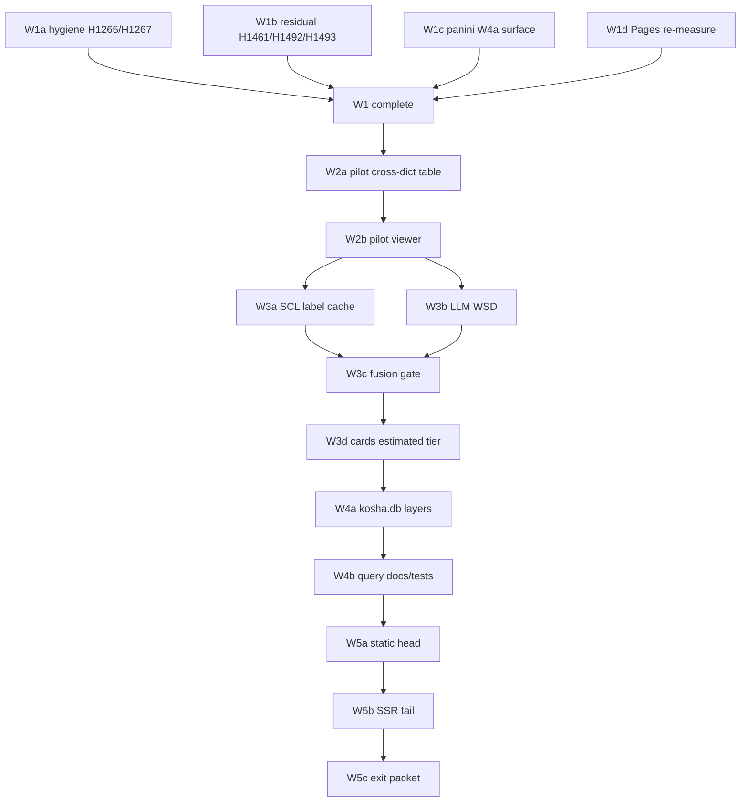

# Roadmap — kosha next programme (2026 H2)

_Created: 24-07-2026 · Last updated: 30-07-2026_

**🔒 SUPERSEDED 30-07-2026 (H1943):** the portfolio-status roadmap role is now
[docs/ROADMAP.md](https://github.com/gasyoun/kosha/blob/main/docs/ROADMAP.md)
→ [docs/ROADMAP_KOSHA_2026_2027.md](https://github.com/gasyoun/kosha/blob/main/docs/ROADMAP_KOSHA_2026_2027.md).
Preserved in place as immutable historical evidence; not current status.

<!-- H1588 W3 WSD shipped 24-07-2026 — see Wave 3 status below -->

Index: [PLAN_KOSHA_NEXT_PROGRAMME_2026H2.md](https://github.com/gasyoun/kosha/blob/main/docs/PLAN_KOSHA_NEXT_PROGRAMME_2026H2.md).

## Where the repo stands (24-07-2026)

| Signal | State |
|---|---|
| A4 W1–W3 | **Done** — rights, A3 join, derivation, invert, coverage map (H1468), **data-v0.3.0** (H1574) |
| A4 W4 | **Open** — panini surface polish (coverage+chain honesty) + Pages budget re-measure |
| Sense-frequency W1 | **Done** — 3-layer gold + cards; genre/dispersion de-biasing shipped |
| Sense-frequency W2 (WSD) | **Done 24-07-2026 (H1588)** — MFS single-witness after SCL fail-closed; held-out 83.96% |
| Sense-reconciliation W1 | **Done** — per-sense attestation + KWIC + MBh vulgate |
| Sense-reconciliation W2 | **Open** — pilot cross-dict view (ruling N5) |
| Pedagogy | W0–W3, RU, T **done**; residual 🟡 H1461 / H1492 / H1493 |
| Product public URL | Still MG-gated on samskrtam.ru; plan **assumes near-term deploy** (N6) |
| Latest code tag | v0.84.0 area; HEAD includes W3b |

## Wave order

### Wave 1 — residual drain + A4 surface (runnable now)

| ID | Deliverable | Blocks | Tier | Handoff |
|---|---|---|---|---|
| **W1a** | Execute staged hygiene: H1265 README count invariant · H1267 DEAD_ENDS | Bookkeeping | Haiku | existing |
| **W1b** | Execute staged pedagogy residual: H1461 Zaliznyak drills · H1492 Śāstra sandhi · (optional) H1493 Gītā prose | Surfaces | Sonnet | existing |
| **W1c** | **W4a panini surface complete** — coverage view (dark classes distinct) + chain view + `/viz-page` trust block on `concordance/panini/` | A4 exit | Sonnet | **new** |
| **W1d** | **W4b Pages budget re-measure** with A4 pages + static-head projection logged | R-Q3 | Haiku/Sonnet | **new** |

W1a–W1d are independent of each other (W1c may consume W3a artefacts already on main).

### Wave 2 — sense-reconciliation pilot cross-dict view

| ID | Deliverable | Depends on |
|---|---|---|
| **W2a** | Side-by-side PWG↔MW↔Apte sense table for the **500-headword pilot** only | Sense W1 outputs (`sense_corpus_concordance.tsv`, pilot list) |
| **W2b** | Pilot viewer page (Pages-hostable) + manifest/data-statement | W2a |

Human sample / review-sheet remains **deferred ~6 months** per original recon plan — not in this wave.

### Wave 3 — full-corpus two-witness WSD — **DONE (H1588, 24-07-2026)**

| ID | Deliverable | Status |
|---|---|---|
| **W3a** | SCL scrape harness → **gitignored** minimal label cache | Fail-closed (H057); reason in `.cache/` |
| **W3b** | Gloss-grounded / MFS WSD + held-out WordSem eval | **83.96%** held-out (gate ≥70% PASS) |
| **W3c** | Fusion → `provenance=estimated` rows | 13,709 rows / 4.5M tokens |
| **W3d** | Light up `estimated` tier on word-page badge | `app/word_page.py` |

### Wave 4 — data-hub P-D5 (queryable DB layers)

| ID | Deliverable | Depends on |
|---|---|---|
| **W4a** | Ingest selected public join-table assets from the manifest into `kosha.db` as attached layers (LEFT JOIN pattern of frequency) | Manifest rows; rights per row |
| **W4b** | Document query surface + tests; no public redistribution of restricted rows | W4a |

### Wave 5 — product SSR (deploy-assumed)

| ID | Deliverable | Depends on |
|---|---|---|
| **W5a** | Static head word pages at **N = 11,148** (95% DCS token mass) committed or build-scripted under Pages budget | D4/D5 standing rule |
| **W5b** | SSR long-tail `GET /w/{slp1}` parity with prerender (already partially built — complete exit checks) | Server deploy for live exit |
| **W5c** | P5 exit checklist packet (Lighthouse mobile ≥90, paste-a-Gītā-verse walkthrough, live staging sign-off) | W5a+W5b; MG deploy |

### Migration M1 (not a numbered wave)

Repoint to samskrtam.ru when MG confirms deploy live — config/`PUBLIC_BASE` only if R1/R5 held. Independent of wave order.

## Explicit non-goals

| Item | Why out |
|---|---|
| P6 trilingual RU product layer | G5 review + Kochergina rights still human-gated (N10) |
| Re-opening D6 relaxed concordance tier | Ruled dropped |
| Re-deriving A4 W1–W3 artefacts | Shipped |
| Full-inventory sense recon (beyond pilot) | Deferred past W2 |
| Sense-order standalone paper authorship | GTD `@DECIDE` only (N11) |
| Analytics ESP / magic-link email provider | Explicitly out of W5 product package (N7) |
| Audio / Wave 4 pedagogy audio | Field/Systema-owned |
| Rebuilding WhitneyRoots / SanskritKaraoke / csl-guides surfaces | Integrate only |

## Dependency graph

Waves after W1 may start once their inputs exist; the diagram is the **preferred** order under N2, not a hard serial lock on independent file sets.

---

_Dr. Mārcis Gasūns_
